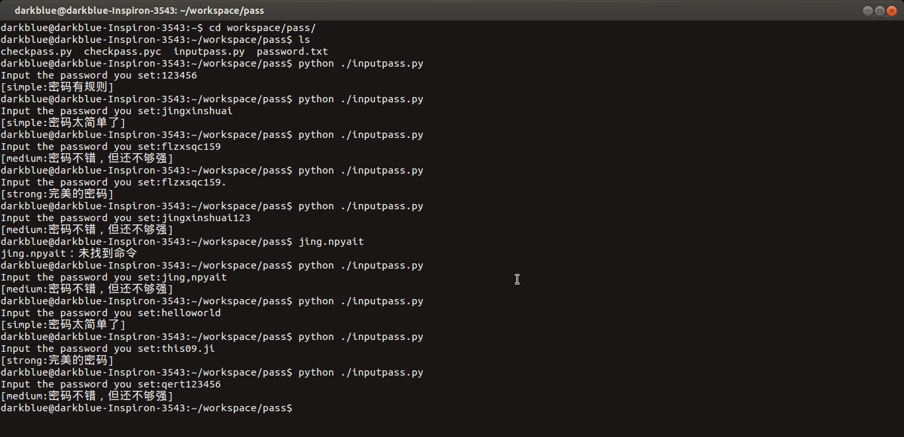
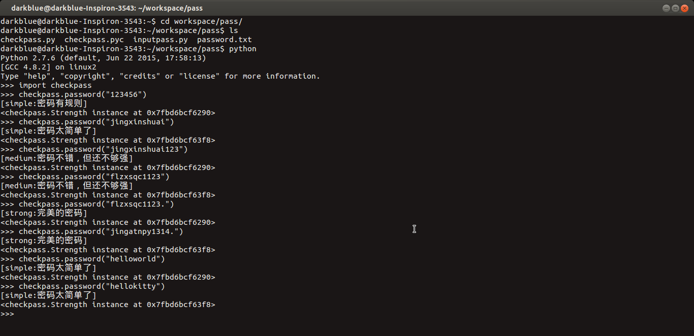

# EasyPass

&nbsp;&nbsp;&nbsp;&nbsp;&nbsp;
使用Python编写的密码强度检测器

## 演示截图

文件调用示例

模块调用示例

## 项目介绍

* checkpass.py文件：定义密码强度检测类和强度显示类，同时封装了一些强度检测函数，针对常用的密码进行字典查找检测，支持命令行引用和文件引用。

* inputpass.py文件：实例化密码强度检测类，并针对用户输入的密码进行强度检测返回检测结果。

* password.txt：常见的密码字典文件，保存了常用的10000个密码。

## 项目部署

* git clone或download所有文件。

* python运行inputpass.py或命令行导入checkpass模块。

* 命令行下输入密码，返回密码强度。
