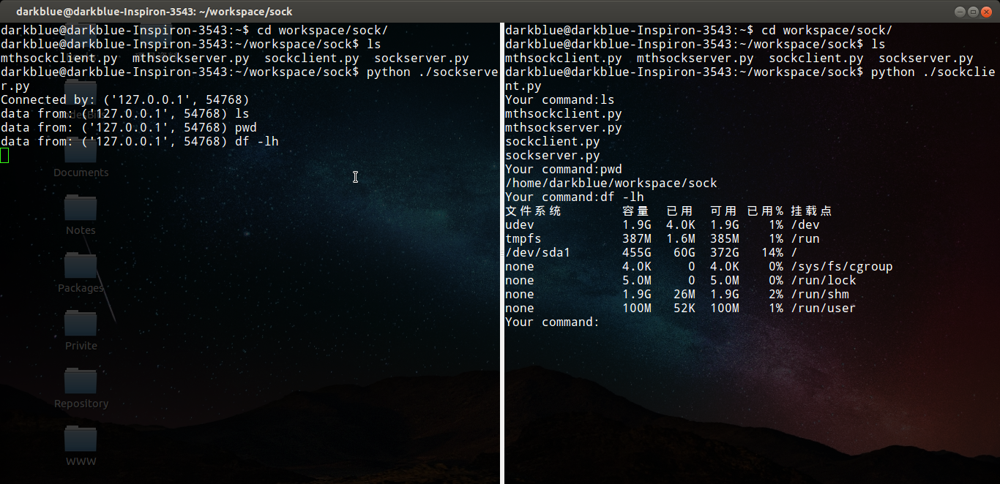
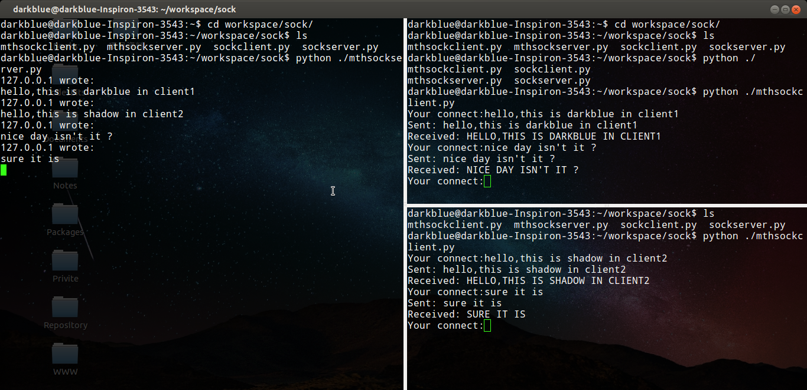
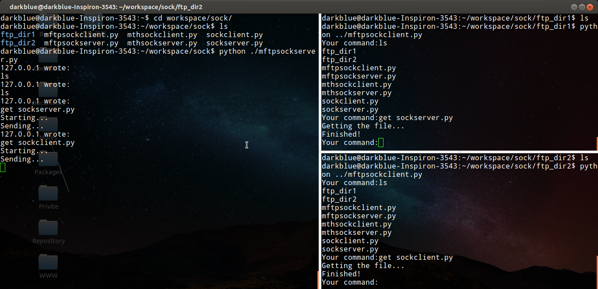
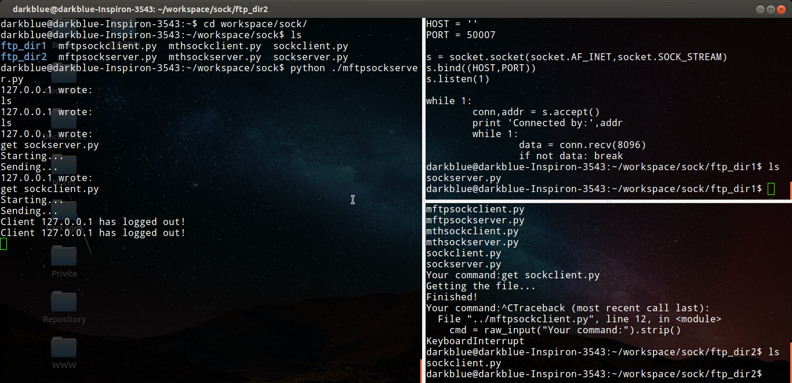
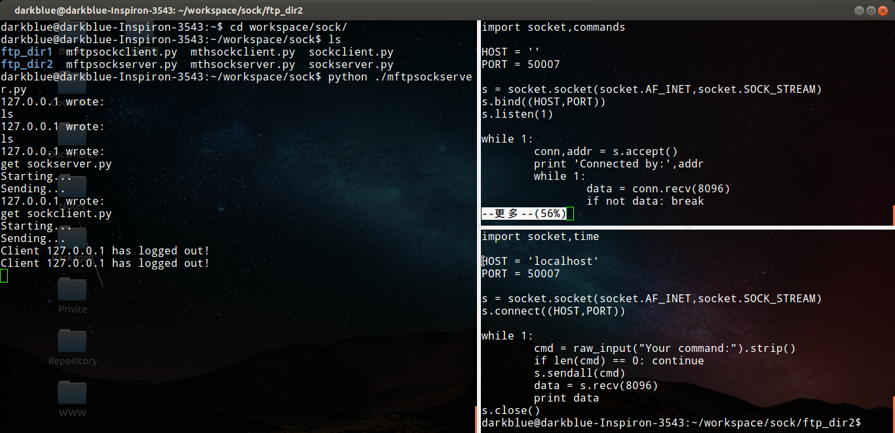

# EasySock

&nbsp;&nbsp;&nbsp;&nbsp;&nbsp;
使用Python实现的Socket程序

## 演示截图

socket模拟SSH协议

socket多线程并发处理

socket多线程并发文件下载

## 项目介绍

* sock文件夹：使用Python编写的单线程socket程序，分为服务端和客户端两个脚本。模拟SSH远程登陆Linux主机并执行Shell命令。

* msock文件夹：使用Python编写的多线程socket程序，分为服务端和客户端两个脚本。通过多线程实现多用户与服务端同时交互。

* mftp文件夹：使用Python编写的多线程socket程序，分为服务端和客户端两个脚本。模仿ftp文件下载和上传功能。

## 项目部署

* git clone或download客户端和服务端脚本，分别存放至客户端主机和服务端主机上。

* python先运行服务端脚本。

* python后运行客户端脚本。

* 客户端输入命令或交互内容，服务端返回执行结果。
